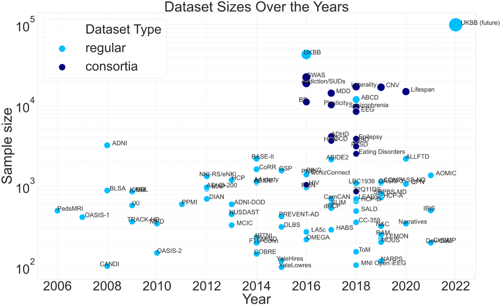
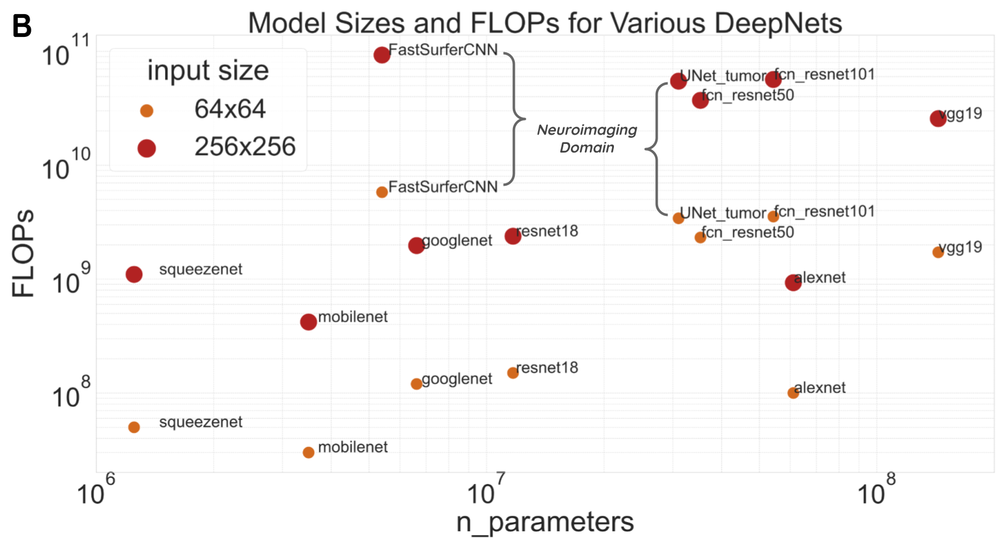
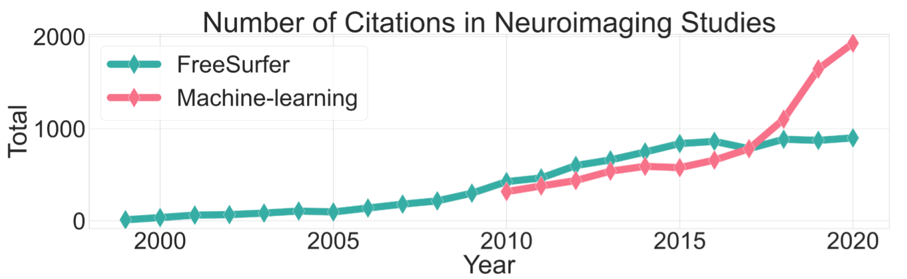
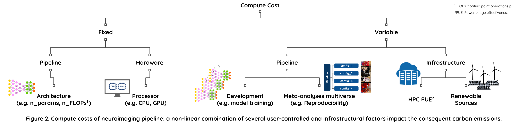
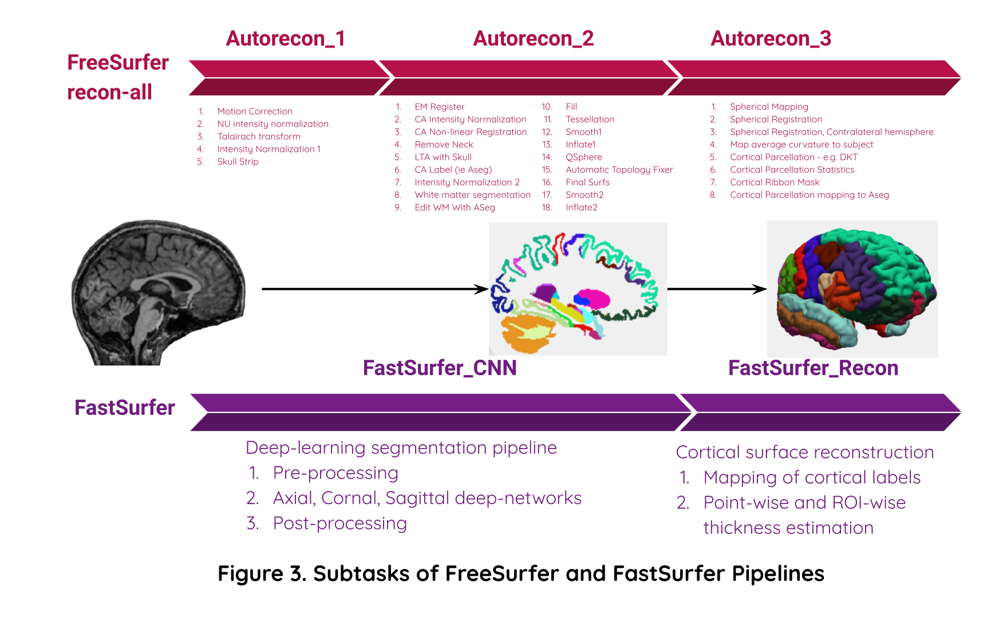

---
title: Carbon Footprinting
layout: template
filename: 10carbon
--- 

## Carbon Footprint Quantification

The increasing supply of large datasets and machine-learning models has pushed the computational demand beyond Moore’s law [1,2]. The success of deep-learning models in the areas of image segmentation, classification and natural-language-processing (NLP) has enabled the development of novel applications in the field of neuroimaging towards image processing, clinical diagnosis and prognosis. So far, the research effort in this area has mainly focussed on achieving state-of-the-art task-accuracy via Monte-Carlo sampling of bigger and more complex model architectures. With the popularization of deep-learning approaches, it is important to take account of the compute costs and the consequent environmental impact of such model selection strategy [3,4]. The carbon footprint of training an AI model is estimated to be 284,000 Kgs (626,000 pounds) of CO2 (~5x lifetime emissions of a car or ~300x RT-flights for single passenger between NYC and SF [2,4]. Moreover, the energy consumption of the deep-learning based and the existing neuroimaging pipelines during deployment needs to be estimated in order to minimize the carbon emissions resulting from processing of big datasets, such as UKBiobank. 

This working group aims to: 
* Compare various carbon footprinting tools available for use in neuroimaging pipelines
* Benchmark the carbon emissions of existing and novel neuroimaging pipelines 
* Propose strategies to promote environmentally sustainable research practices in computational neuroscience 

***
## Benchmarks (Preliminary)

### Dataset and model sizes over the years

Neuroimaging dataset sizes compiled from review articles by [Madan 2021](https://link.springer.com/article/10.1007/s12021-021-09519-6) and [Thompson et al 2020](https://www.nature.com/articles/s41398-020-0705-1).  

Deep-learning model architectures. Compute costs depend on number of parameters and the floating point operations (FLOPs). FLOPs are calculated using this Pytorch [flop-counter](https://github.com/sovrasov/flops-counter.pytorch).

| Dataset sizes | Model sizes | 
|-----------------------|---------------|
|    |  |

A conservative estimate of pipeline usage based on citations. The first pipeline is [FreeSurfer](https://surfer.nmr.mgh.harvard.edu/fswiki/rel6downloads) - one of the most commonly used pipeline for structural MR imaging analysis. The second pipeline is [FastSurfer](https://www.sciencedirect.com/science/article/pii/S1053811920304985?via%3Dihub) - a recent novel deep-learning alternative for FreeSurfer tasks. 

FreeSurfer citation counts based on [Dale et al](https://pubmed.ncbi.nlm.nih.gov/9931268/) and [Fischl et al](https://pubmed.ncbi.nlm.nih.gov/9931269/) papers in Scopus. ML citation count includes only MR neuroimaging studies in Ovid MEDLINE. 

 

### Classification of compute costs 
Several user-specific and infrastructure-specific factors contribute to the carbon footprint of neuroimaging pipelines. 

 

### Compute costs of FreeSurfer vs FastSurfer
- Task: Volumetric brain segmentation and cortical thickness estimation with DKT parcellations
- Hardware: Proc: CPU (Intel Xeon(R) Gold 6148 @ 2.40GHz) vs. GPU (Tesla V100-SXM2-16GB CUDA:11.0)
- HPC Cluster: [Compute Canada](https://docs.computecanada.ca/wiki/Getting_started) @ Quebec, Canada (PUE ~ 1.2)

### Image processing tasks part of FreeSurfer and FastSurfer pipelines:
 

#### Compute cost metrics
1. Runtime 		
2. Power draw 		
3. Carbon emissions

#### Compute cost tracker: [experiment-impact-tracker](https://github.com/Breakend/experiment-impact-tracker)

Note: The values in table are for processing of a single T1w MRI scan. A typical inference/deployment pipeline may incur over 10k of these runs for a large dataset. And a model training/development pipeline may incur over 1M runs.

| Pipeline (single run) | Runtime (hrs) |            | Power (W-hrs) |            | Carbon Emissions (grams) |            |
|-----------------------|---------------|------------|---------------|------------|--------------------------|------------|
|                       | CPU           | GPU        | CPU           | GPU        | CPU                      | GPU        |
| FreeSurfer            | 8.3 (1.03)    | N/A        | 108.5 (19.8)  | N/A        | 3.26 (0.5)               | N/A        |
| FastSurfer            | 9.8 (0.74)    | 1.6 (0.47) | 126.4 (16.1)  | 26.7 (7.7) | 3.79 (0.5)               | 0.80 (0.2) |

***

### TL;DR
- FreeSurfer: Processing 10k scans would take 3471 cpu-days and produce 32 kg carbon emissions. 
- FastSurfer: Processing 10k scans would take 4107 cpu-days or 671 gpu-days and produce 38 kg (cpu) or 8 kg (gpu) carbon emissions. 
- There is an inherent trade-off between runtime and power usage. GPU saves time → consequently reduces power draws per experiment; but increases power draws per day for a machine. 
- It’s important to consider both per experiment vs per capita (i.e. researcher/machine) costs. 
- Model training experiments have higher compute costs compared to inference/deployment. We need to employ better model selection strategies to minimize per capita costs of increasing GPU usage. 
- There are added costs incurring from meta-analytic efforts to improve reproducibility and make science open and accessible. Nonetheless irreproducible science is not sustainable! 
- Similar to open and reproducible science practices, we need to recalibrate our research objectives at individual and infrastructural levels to include sustainability criteria. 

***

## References:

1. Amodei D, Hernandez D, Sastry G, Clark J, Brockman G, Sutskever I. [AI and Compute](https://openai.com/blog/ai-and-compute/). Published May 16, 2018.
2. Hao, Karen. [Training a single AI model can emit as much carbon as five cars in their lifetimes](https://www.technologyreview.com/2019/06/06/239031/training-a-single-ai-model-can-emit-as-much-carbon-as-five-cars-in-their-lifetimes/). MIT Technology Review (2019).
3. Schwartz R, Dodge J, Smith NA, Etzioni O. Green AI. arXiv [csCY]. Published online July 22, 2019. 
4. Emma Strubell, Ananya Ganesh, and Andrew McCallum. Energy and policy considerations for deep learning in NLP. In Proceedings of the 57th Annual Meeting of the Association for Computational Linguistics, pages 3645–3650, 2019.

## Resources

Quantifying carbon footprint of neuroimaging pipelines is one of the key objectives of our workgroup. Some of these tools could be useful in developing a complete solution. 
* [Experiment-impact-tracker](https://github.com/Breakend/experiment-impact-tracker)
* [Carbontracker](https://github.com/lfwa/carbontracker/)
* [CodeCarbon](https://github.com/mlco2/codecarbon)

## Further information
For details on benchmarking experiments contact: [Nikhil Bhagwat](nikhil.bhagwat@mcgill.ca)

***

